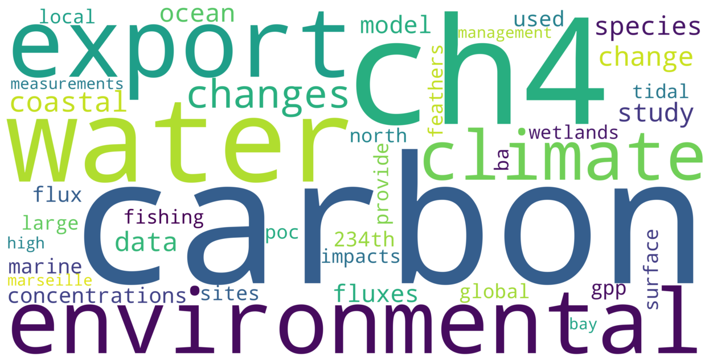

# 🧠 SciCloud

**SciCloud** is a simple Python tool to tokenize text documents, clean and normalize the tokens, and generate high-resolution word clouds based on word frequencies. It's built with `NLTK`, `matplotlib`, and `wordcloud`, and features a GUI file dialog for loading text files and saving the output.

---

## 📦 Features

- Word frequency analysis
- Customizable word clouds
- Interactive file selection for both input and output
- Tokenize text using NLTK, with special handling for common patterns like `al.`
- Custom and standard stopword removal

---

## 🚀 Quick Start

### 1. Installation Guide
#### 1.1 Clone the repository

First, clone the repository locally.
```bash
git clone https://github.com/henrique-back/scicloud.git
```
#### 1.2 Create a virtual environment

Next, create a virtual environment. Open the terminal in the project folder and run:
```bash
python -m venv venv
```

Activate the virtual environment:
- **Windows**
```bash
venv\Scripts\activate.bat
```

- **Linux**
```bash
source venv/bin/activate
```
#### 1.3 Install the SciCloud Package

```bash
pip install .
```

### 2. Create .txt file
SciCloud will read a .txt file containing the text to be processed. This is usually a compilation of abstracts from scientific publications, but could be any kind of text.
To do this, simply create a new .txt file in the docs folder. Then, copy and paste all the texts you wish to include.
SciCloud will treat everything as a single document, so don't worry about indicating where one abstract finishes and the other starts.

### 3. Run main.py
In the terminal, run python -m src.main

You'll be prompted to choose a .txt file. After processing, a word cloud will be displayed, and you'll be prompted to save it.

## Word Cloud Example

Here is an example of the word cloud generated from the input text:



This word cloud visualizes the most frequent terms from the abstracts of scientific publications in 2024 by the MERS (Marine and Environmental Biogeosciences) research group at the Universitat Autònoma de Barcelona.


